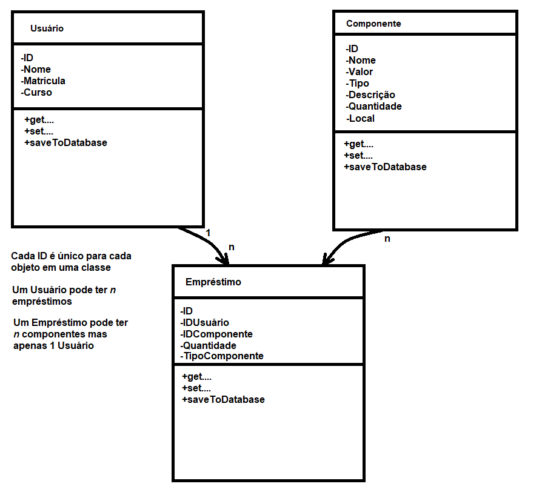
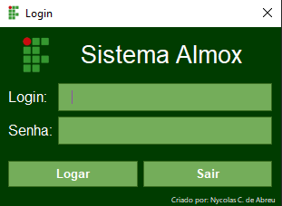
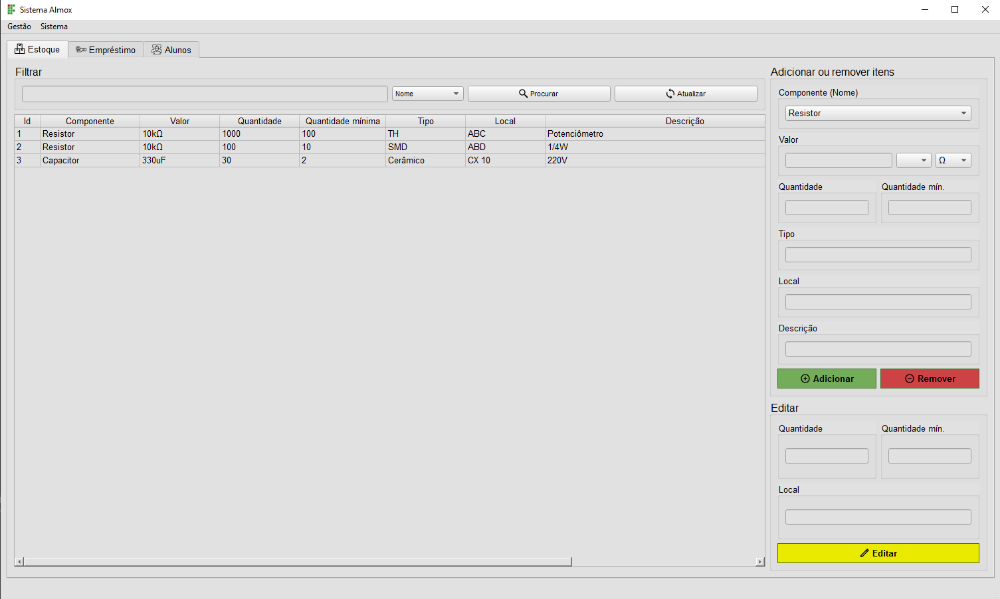
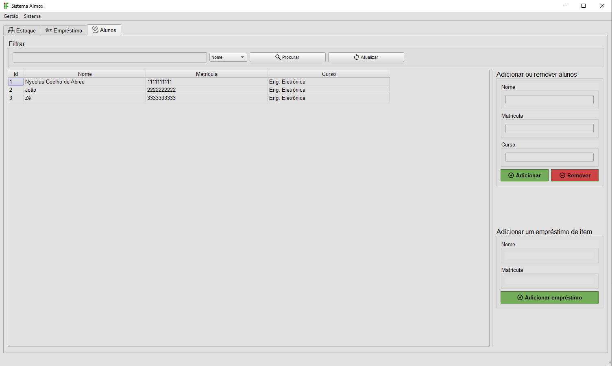
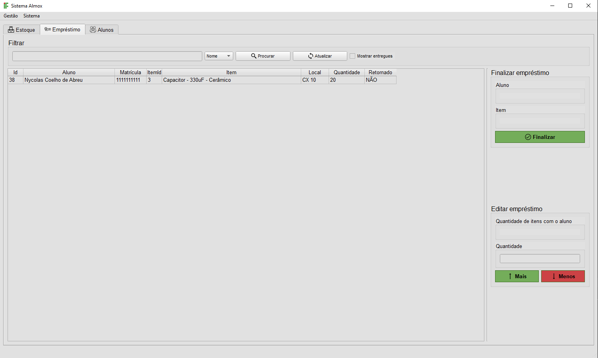

Nycolas Coelho de Abreu, IFSC - Florianópolis 

# Sistema Almoxarifado

## SUMÁRIO

1. Sistema Almox
2. Problema
3. Objetivo
4. Funcionalidades

# Sistema Almoxarifado

O objetivo deste trabalho será o desenvolvimento de um sistema de gestão para o almoxarifado do IFSC.

## Problema

- Falta de organização e praticidade no sistema de gestão do almoxarifado existente do DAELN.
- É utilizado planilhas simples de Excel para fazer o controle de centenas de alunos e milhares de itens.
- Alunos não sabem o que estão devendo para o almoxarifado.

## Objetivo

- Organizar os dados em um sistema de gestão simples e eficaz.
- Utilizar uma interface gráfica utilizando o framework Qt para uma fácil manipulação de itens e usuários.
- Utilizar um banco de dados no formato SQL para integração com outras aplicações, por exemplo o SIGAA.

## Funcionalidades

- Adicionar usuários(alunos), armazenar dados de saída e entrada de itens em seu cadastro.
- Cadastro de itens, para um melhor controle interno de estoque.
- Balanço de quantidade mínima para itens críticos.
- Interfaçe amigável.

## TODO

- [X] Publicar no github.
- [X] Adicionar README.
- [X] Receber feedback dos técnicos do almoxarifado.
- [X] Banco de dados para componentes.
- [X] Banco de dados para alunos.
- [X] Banco de dados para empréstimo.
- [X] Tela Login.
- [X] Tela Principal.
- [X] Tela Estoque.
- [X] Tela Alunos.
- [X] Tela Empréstimos.
- [X] Classe Usuário.
- [X] Classe Item.
- [X] Classe Empréstimo.
- [X] Funcionalidade do empréstimo.
- [X] Proteção dos valores adicionados.

## Feedback dos técnicos

Versão 1:
- Criar BD para os componentes: básicos: local, componente, tipo, valor, descrição, quantidade.
- Criar BD para os usuários: matrícula, nome e curso.
- Criar interface gráfica.

a) Gerenciamento das gavetas
- Controle da quantidade de componentes das gavetas. Deve ter um campo texto com a localização do componente no gaveteiro. EX: 1A2 (1 coluna, A linha, 2 gaveta);
- Capacidade mínima (criar alerta) e máxima das gavetas;

b) Controle de empréstimo

- Quando o aluno retirar componente o registro é feito pelo valor correto. Deve-se então reduzir da quantidade disponível na gaveta. Porém, quando o aluno devolver o componente, na tela de devolução, os componentes devem ser agrupados. Por exempolo, resistores agrupados pela potência, capacitores agrupados pelo tipo, etc (enviar exemplo do arquivo utilizado atualmente). Quando o aluno devolve o componente é inviável o bolsista verificar cada unidade e dar baixa de acordo com o valor exato. Por isso, deve-se realizar o agrupamento. Na devolução dos componentes a quantidade devolvida não deve ser adicionada na qauntidade disponível na gaveta, pois não é realizado a conferência do valor exato. Quando o aluno devolver o componente, deve-se retirar a quantidade devolvida aleatoriamente ods componentes daquele grupo.

- A quantidade disponível nas gavetas deve ser atualizada em dois casos. No primeiro quando o aluno retira o componente. O segundo caso, a quantidade é alterada pelo bolsista que após fazer a classificação dos componentes ele irá guardá-los em suas respectivas gavetas.

c) Tipos para agrupamento dos componentes:

- Resistor: 1/4W 1/2W 1W 2W 5W 10W LDR NTC Precisão Potenciômetro Trim-pot
- Capacitor: Cerâmico Poliester Eletrolítico Trimmer
- LED: 3mm 5mm Alto Brilho Bicolor RGB Display 7seg
- DIODO: 1N400x 1N4148 Zener 0,5W Zener 1W Zener 5W MUR Ponte Retificadora Outros
- Transistor: 2Nxxxx 2Sxxxx BC BD BF IRF TIP Outros
- CI: 555 AMPOP CMOS (4xxx) TTL (74xx) 78xx/79xx/LM3xx LM35 IR/ SG/ KA TDA TL431 ULN Outros
- Tiristor: DIAC BT TIC Outros
- Chaves: Alavanca H-H Push-Button Táctil
- Miscelâneos: Barra pino Borne banana Cristal Optoacoplador Pino banana Relé Soquete barra Soquete CI

## UML

## Implementação

Para a implementação do software de gerenciamento de itens, foi utilizado o framwork QT, um framework multiplataforma para desenvolvimento de interfaces gráficas complexas em C++. Com ele é possível desenvolver aplicativos e compilá-los para diversas plataformas sem que seja necessário alterar o código fonte.

Para o armazenamento dos dados foi utilizado o banco de dados SQLite que implementa um mecanismo de banco de dados SQL pequeno, rápido e de alta confiabilidade.

Utilizando o conhecimento adquirido em Programação Orientada a Objetos foi possível organizar o projeto de maneira mais eficiente com base na separação de classes e métodos para cada ferramenta do programa, dando uma longevidade maior ao código e facilitando a sua correção no futuro.

O código foi separado em três partes principais, a parte de cadastro e edição de itens, em seguida a parte de cadastro e edição de alunos e por fim a parte de inserção e remoção de empréstimos.
Cada bloco de código está separado de acordo com sua respectiva parte, utilizando o método de clean code, onde não é utilizado comentários para fazer a explicação do seu funcionamento, já que o nome do método ou variável é auto explicativo.

## Funcionamento 

- Primeiramente temos uma tela de login para proteção dos dados.

- A seguir temos a tela de estoque, onde é possível adicionar, remover e editar os itens em estoque.

- Para adicionar um aluno deve-se acessar a tela de alunos, onde é possível também lançar um empréstimo para o aluno selecionado.

- Ao selecionar um aluno e lançar um empréstimo, será aberta uma nova janela para selecionar os itens que serão emprestados.

- Para ter o controle de todos os empréstimos e de cada aluno separado basta abrir a janela de empréstimos, onde pode-se entregar e receber itens ou finalizar o empréstimo.

Todas as janelas possuem proteção de entrada de dados, e alertas de mensagem quando alto estiver fora dos padrões estabelecidos.

## Futuro do trabalho

Primeiramente é necessário uma melhora no banco de dados, que está com duplicação de informação entre as tabelas, podendo acarretar um erro de sincronização caso algum item ou aluno seja removido de maneira indevida.
Será necessário implementar a funcionalidade requerida pelos técnicos do almoxarifado, crinado uma espécie de quarentena de itens, agrupando pelos seus tipos, simplificando o momento de entrega.
